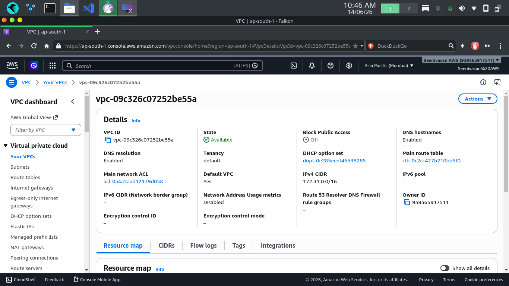
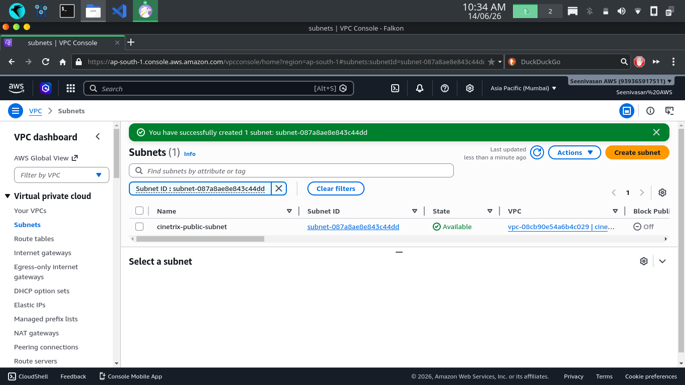
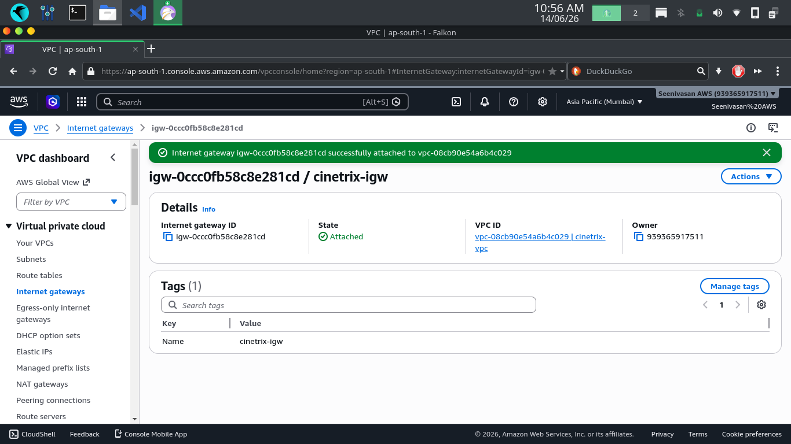
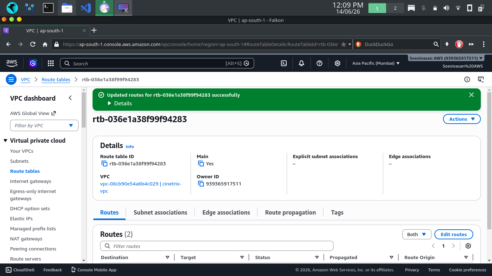
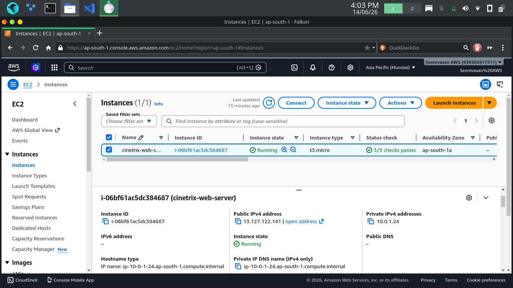
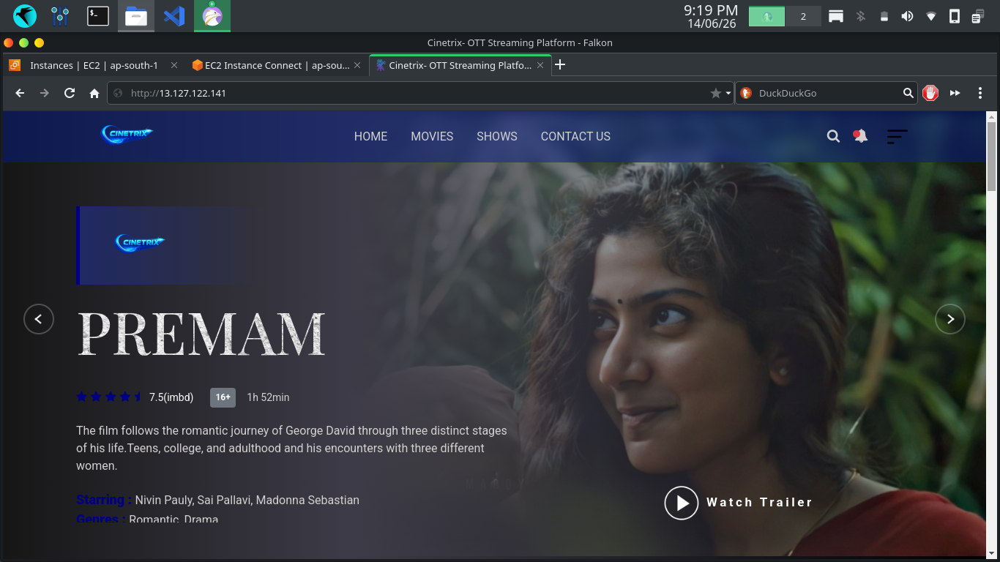
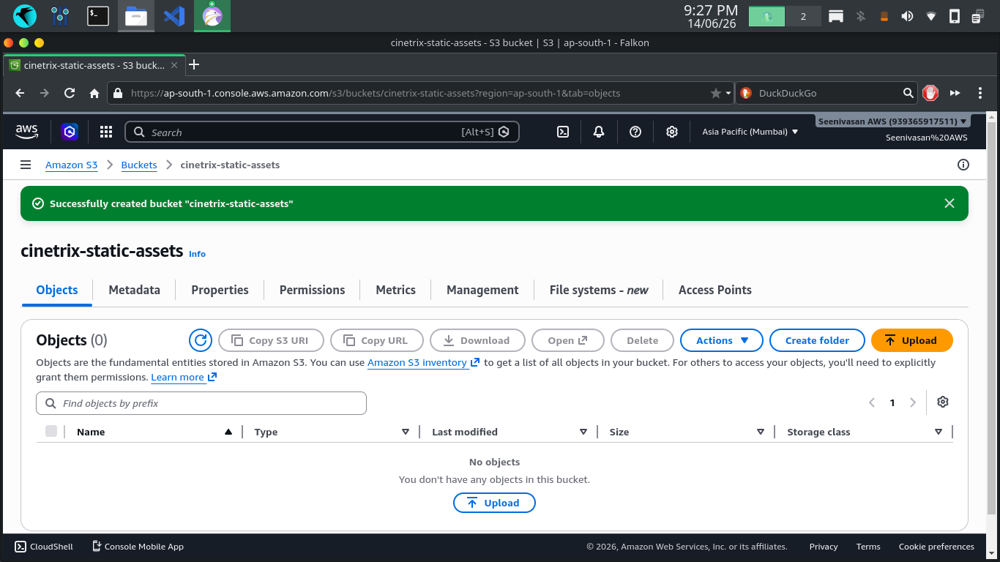
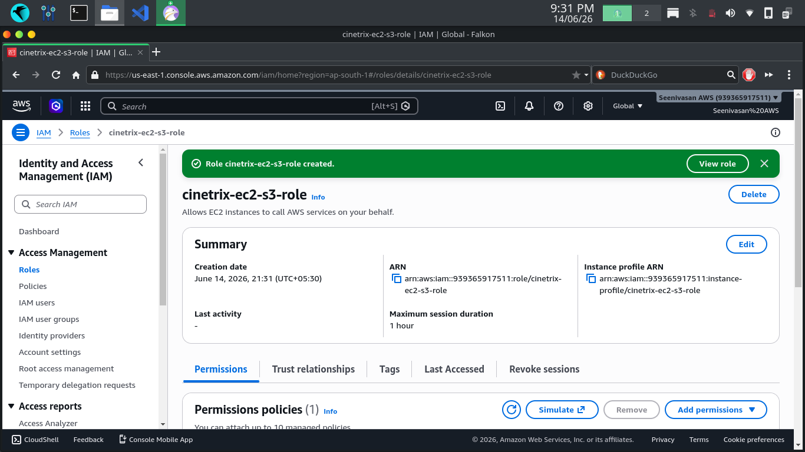
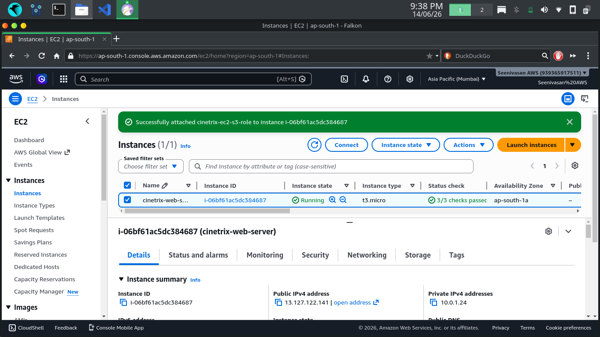
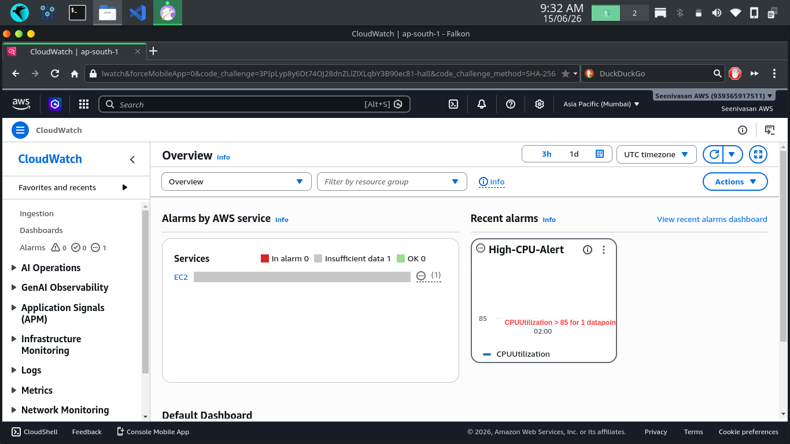

# Web Application Deployment on AWS

## Project Overview
Deployed Cinetrix OTT web application on AWS EC2 inside a custom VPC using Apache web server with S3 storage and IAM role configuration.

## Services Used
- AWS VPC (Custom)
- AWS EC2 (t3.micro)
- Apache Web Server
- AWS S3
- AWS IAM
- AWS CloudWatch
- AWS Security Groups

## What I Built
- Created custom VPC with CIDR 10.0.0.0/16
- Configured public subnet, Internet Gateway, and route tables
- Launched EC2 instance inside custom VPC with Apache web server
- Deployed Cinetrix OTT website accessible via public IP
- Created S3 bucket for static asset storage
- Configured IAM role with S3 read access attached to EC2
- Set up Security Groups with HTTP, HTTPS, SSH rules

## Live URL
http://13.127.122.141

## Screenshots

### VPC Created

### Subnet Created

### Internet Gateway Attached

### Route Table Updated

### EC2 Launched

### Cinetrix Website Live

### S3 Bucket Created

### IAM Role Created

### IAM Role Attached

### CloudWatch Alarm

